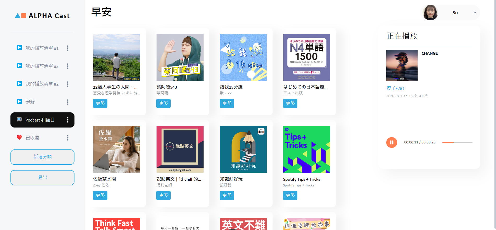

# alpha-cast


## 介紹
串連 Spotify 的撥放器，透過第三方登入連動個人帳號，可進行撥放清單管理、清單內容管理、收聽音樂及 Podcast。

### 功能
+ 用戶可透過 Spotify 登入
+ 新增/刪除/修改/查看撥放清單
+ 新增/查看清單內容
+ 新增/刪除/查看收藏的 Podcast
+ 收聽音樂

## 啟用專案
1. 請確認本地端已安裝 Node.js 和 npm
2. 將此專案clone到本地端
3. 安裝相關套件
```
npm install
```
4. 參考env.example建立.env
5. 運行專案
```
npm start
```
6. 因授權所有人使用的第三方 APP 須經 Spotify 審核通過，故採用少數使用的開發模式，透過以下測試帳號登入

```
account: zxcv1010017@gmail.com
password: *susu725
```
